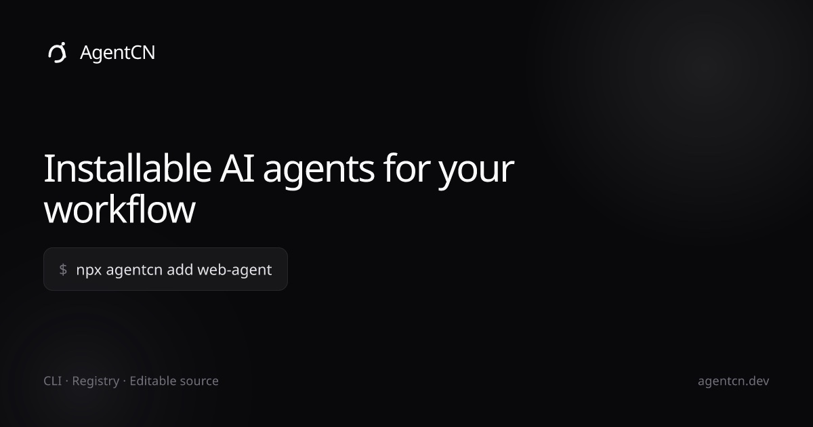

# AgentCN

AgentCN is an open source kit for **installable AI agents**. Use the CLI to pull agent source into your project, run agents locally, and customize prompts and tools in your own codebase as the library grows.



**Docs:** [agentcn.dev/docs](https://agentcn.dev/docs) · **Registry:** [agentcn.dev/r](https://agentcn.dev/r) · **GitHub:** [anayatkhan1/kit](https://github.com/anayatkhan1/kit)

## Features

- **CLI install** — Add agents to any project with `npx agentcn@latest add web-agent` (pnpm, yarn, bun supported).
- **Agent registry** — Hosted JSON manifests at `https://agentcn.dev/r` with local override for development.
- **Editable source** — Agents land in your repo as real TypeScript you can change, not opaque SDK calls.
- **Web Agent** — Browser automation, web search, deep research, and Q&A tools built on the Vercel AI SDK.
- **Docs & previews** — Documentation site with live agent previews and setup guides.
- **Starter template** — [`agentkit-starter`](https://github.com/anayatkhan1/agentkit-starter) for shipping a full agent product fast.
- **TypeScript** — Full type safety across agents, tools, and the CLI.
- **Open source** — MIT licensed. CLI published as [`agentcn`](https://www.npmjs.com/package/agentcn) on npm.

## Built with

- [TypeScript](https://www.typescriptlang.org/)
- [Vercel AI SDK](https://sdk.vercel.ai/)
- [Anthropic](https://www.anthropic.com/) (Claude)
- [Next.js](https://nextjs.org/) (docs site & demo)
- [Nx](https://nx.dev/) (monorepo tooling)
- [Fumadocs](https://fumadocs.dev/) (documentation)
- [Playwright](https://playwright.dev/) / [Anchor Browser](https://anchorbrowser.io/) (web agent browser tools)
- [Exa](https://exa.ai/) (web search)

### Tools

- [pnpm](https://pnpm.io/) (package manager)
- [Nx release](https://nx.dev/features/manage-releases) (versioning & changelogs)
- [Jest](https://jestjs.io/) (agent tests)
- [Prettier](https://prettier.io/) (formatting)

## Quick start

Install the **web agent** into your project:

```bash
pnpm dlx agentcn@latest add web-agent
# or
npx agentcn@latest add web-agent
```

List available agents:

```bash
npx agentcn@latest list
```

Set your API key and run the agent in your app. Full setup is in the [Web Agent docs](https://agentcn.dev/docs/agents/web-agent).

## Getting Started

### Prerequisites

- Node.js 18+ (recommended: 20+)
- pnpm 9+
- Anthropic API key (for running agents locally)

### Clone & install

```bash
git clone https://github.com/anayatkhan1/kit.git
cd kit
pnpm install
```

### Run the docs site locally

```bash
cp apps/web/.env.example apps/web/.env
pnpm web
```

Open [http://localhost:3000](http://localhost:3000) for the marketing site and docs.

### Run the agent demo embed

The docs live preview expects a demo app on port **3001**:

```bash
cd examples/agent-ui-template
pnpm install
pnpm dev:embed    # port 3001 — matches NEXT_PUBLIC_AGENT_DEMO_URL
```

### Build for production

```bash
pnpm deploy:build
```

Runs agent registry generation and the Next.js production build for `@kit/web`.

## Environment Variables

Create a `.env` file at the repo root for agent development:

```env
# Required for running agents locally
ANTHROPIC_API_KEY=your_anthropic_api_key

# Optional: override default registry URL
AGENTCN_REGISTRY_URL=https://agentcn.dev/r
```

For the docs site (`apps/web/.env`):

```env
NEXT_PUBLIC_APP_URL=http://localhost:3000
NEXT_PUBLIC_AGENT_DEMO_URL=http://localhost:3001
```

### Getting API keys

- **Anthropic:** [console.anthropic.com](https://console.anthropic.com/)

## Project Structure

```text
kit/
├── ai/
│   └── agents/
│       └── web/              # Web agent (browser, search, research tools)
├── apps/
│   └── web/                  # agentcn.dev — docs, registry host, marketing
│       ├── content/docs/     # Documentation (MDX)
│       └── public/r/         # Agent registry JSON (generated)
├── packages/
│   └── agentcn/cli/          # `agentcn` npm CLI
├── examples/
│   └── agent-ui-template/    # Local demo app for agent previews
├── scripts/
│   ├── build-agent-registry.mts
│   └── verify-agentcn-registry-live.sh
└── nx.json                   # Nx workspace & release config
```

## Usage

### Install an agent

```bash
npx agentcn@latest add web-agent --dry-run   # preview files
npx agentcn@latest add web-agent --yes       # install without prompts
```

### Develop against a local registry

```bash
pnpm agentcn:registry:build
npx agentcn@latest list -r ./apps/web/public/r
npx agentcn@latest add web-agent -r ./apps/web/public/r --dry-run --yes
```

### Customize an agent

After install, agent source lives in your project (typically under `ai/agents/`). Edit prompts, tools, and model settings directly in TypeScript.

## Developing the monorepo

| Task | Command |
| --- | --- |
| Docs dev server | `pnpm web` |
| Docs production build | `pnpm web:build` |
| Build agent registry | `pnpm agentcn:registry:build` |
| Build CLI | `pnpm agentcn:build` |
| Test web agent | `pnpm test:web-agent` |
| Verify live registry | `pnpm agentcn:registry:verify-live` |
| CLI runner smoke tests | `pnpm agentcn:runner-matrix-smoke` |

Explore projects and tasks:

```bash
pnpm nx show projects
pnpm nx show project agentcn --json
```

## Releasing

The `agentcn` CLI uses [Nx release](https://nx.dev/features/manage-releases) with conventional commits. Changelog entries include PR links, dates, and author credits.

```bash
pnpm release --dry-run --skip-publish   # preview
pnpm release                            # version, changelog, tag, publish
```

Maintainer checklist: [`packages/agentcn/cli/RELEASE.md`](packages/agentcn/cli/RELEASE.md)

## Feature Requests

Open a [GitHub discussion](https://github.com/anayatkhan1/kit/discussions/categories/agent-suggestions) or [issue](https://github.com/anayatkhan1/kit/issues).

## Contribution Guidelines

1. Fork the repository.
2. Clone your fork and create a branch:

```bash
git checkout -b feat/your-feature-name
```

3. Make your changes and test locally (`pnpm test:web-agent`, `pnpm web:build`).
4. Commit with [Conventional Commits](https://www.conventionalcommits.org/) (`feat:`, `fix:`, `docs:`, etc.) — required for Nx release changelogs.
5. Push and open a pull request against `main`.

### Code style

- Match existing TypeScript and file layout conventions.
- Run formatting in `apps/web` before committing: `pnpm web:format:check`

## License

AgentCN is licensed under the [MIT License](./LICENSE) with an additional clause restricting resale of unmodified or minimally modified versions.

See [LICENSE](./LICENSE) for the full text.

---

Built with ❤️ by [Anayat Khan](https://anayat.xyz)
